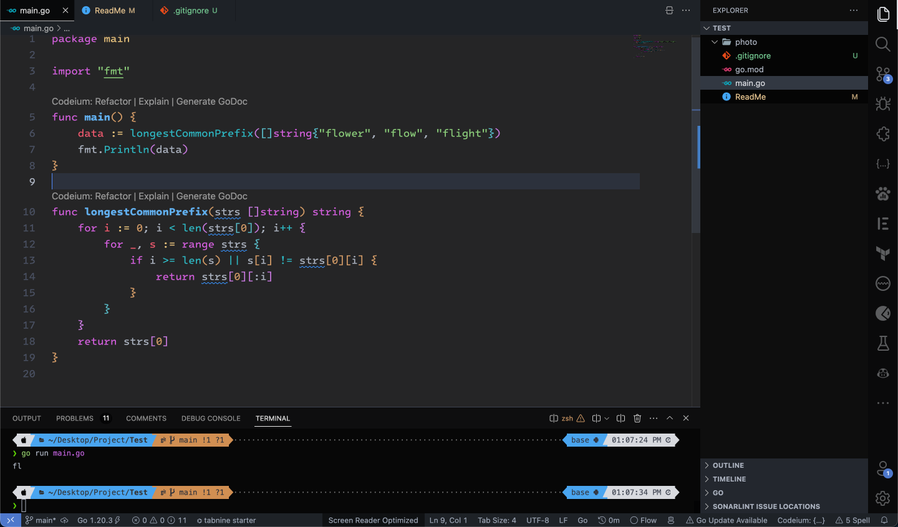
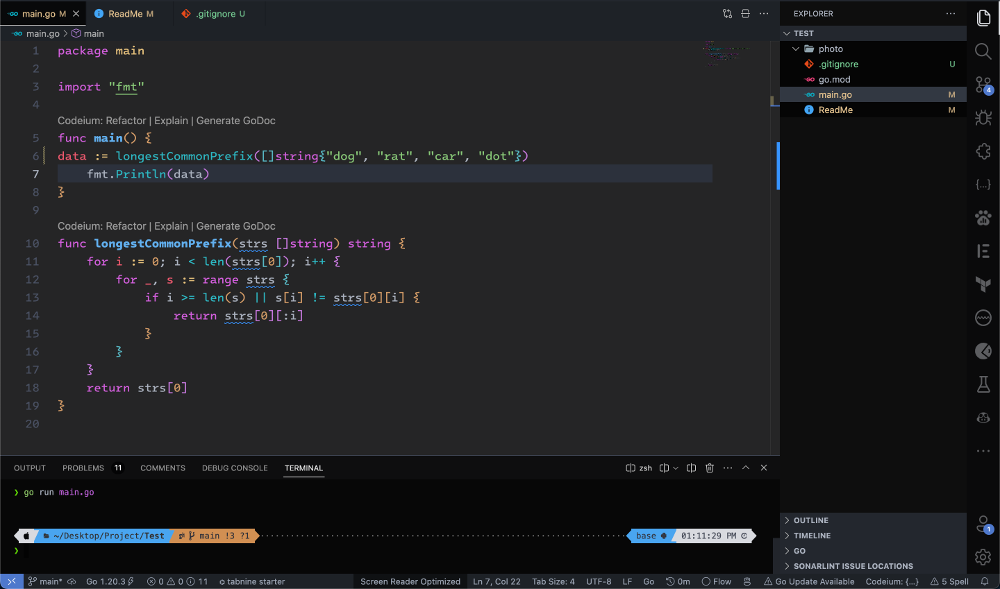

# **Longest Common Prefix**
### Difficulty: **Easy**
---
## **Problem:**
Write a function to find the longest common prefix string amongst an array of strings.
If there is no common prefix, return an empty string "".
### **Link:** **[Leetcode 14](https://leetcode.com/problems/longest-common-prefix/)**

## **Constraints:**
1 <= strs.length <= 200
0 <= strs[i].length <= 200
strs[i] consists of only lowercase English letters.

---
## **Solution:**

```
func longestCommonPrefix(strs []string) string {
	for i := 0; i < len(strs[0]); i++ {
		for _, s := range strs {
			if i >= len(s) || s[i] != strs[0][i] {
				return strs[0][:i]
			}
		}
	}
	return strs[0]
}
```
---
## **Test Cases**
### **Example 1:**

Input: strs = **["flower","flow","flight"]**<br />
Output: **"fl"**



---

### **Example 2:**
Input: strs = **["dog","rat","car","dot"]**<br/>
Output: **""** <br/>
Explanation: There is no common prefix among the input strings.



---

### **Example 3:**
Input: strs = **["abc","abcd"]**<br/>
Output: **"ab"**

